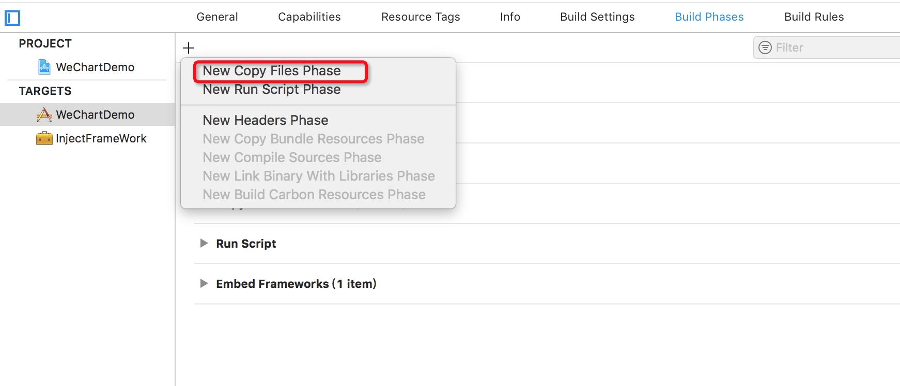
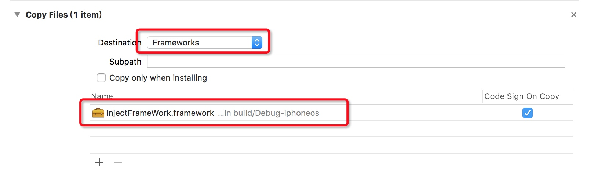
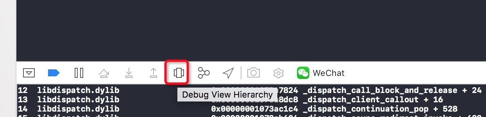
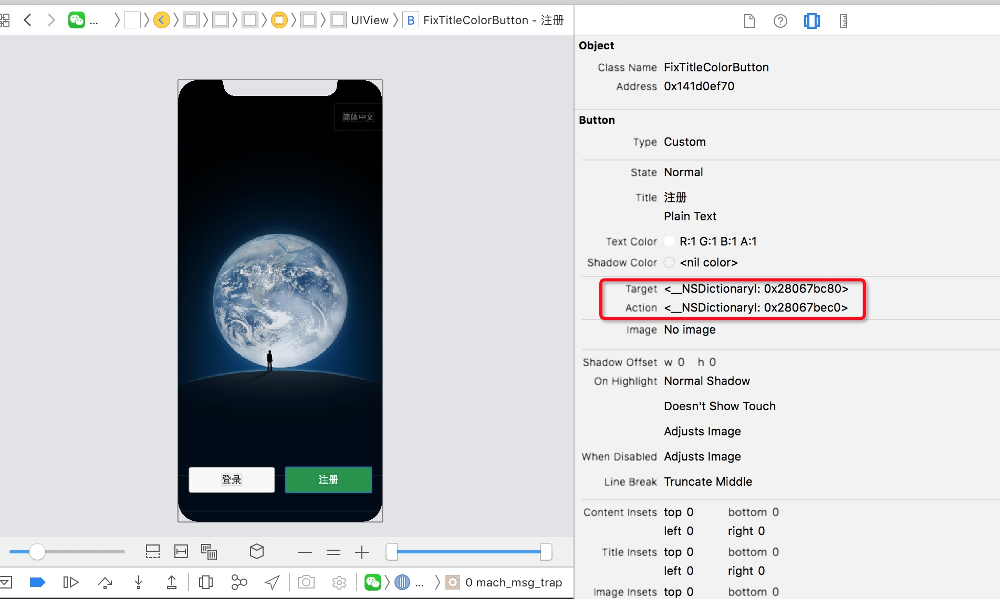
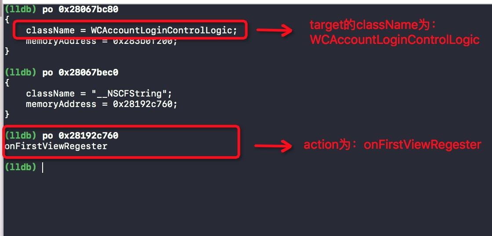
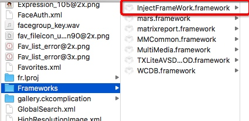
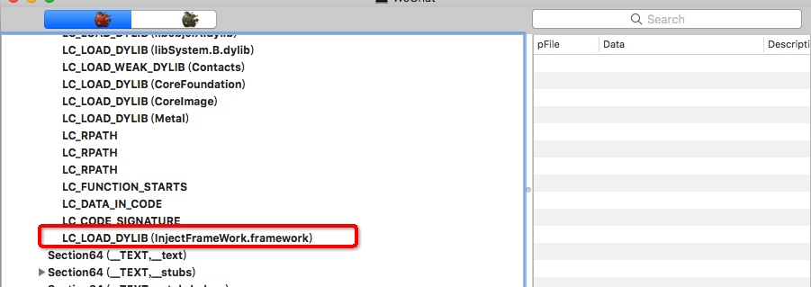

[toc]

## 准备工作
* 下载`PP助手` mac版，用来获取越狱砸壳应用。[下载地址](http://pro.25pp.com/pp_mac_ios)
* 下载`yololib`小工具，用来把自己的动态库注入到MachO文件中。[下载地址](https://github.com/KJCracks/yololib)
* 下载`class-dump`，用来导出MachO文件的头文件。[下载地址](http://stevenygard.com/projects/class-dump/)
* 下载`MachOView`，用来查看MachO文件信息。[下载地址](https://sourceforge.net/projects/machoview/)


## 利用Xcode重签名第三方APP原理

**Xcode在编译的时候会把源代码打包成MachO文件放在Products文件夹下，运行时把Products文件夹下的.app文件运行到设备上，拷贝逆向的应用的xxx.app到Xcode的Products文件夹下骗过Xcode。**

1. 把逆向的目标IPA文件解压，把子文件夹Payload下的XXX.app文件拷贝到Xcode的Products文件下替换掉原来工程自己的.app文件

	```
	unzip -oqq $TARGET_IPA_PATH -d $TARGET_TEMP_PATH
	```

2. 由于Xcode签名的证书文件包含的是当前Xcode工程的包名，而拷贝过来的第三方APP的XXX.app文件中包名不匹配，所以无法完成签名，所以需要修改XXX.app里的info.plst中的字段CFBundleIdentifier为当前工程的包名。
	

	```
	#这里用到一个Mac自带的小工具PlistBuddy，用于修改plist文件，语法[set :key value filePath]
	
	/usr/libexec/PlistBuddy -c "set :CFBundleIdentifier $PRODUCT_BUNDLE_IDENTIFIER" "$PRODUCT_APP_PATH/info.plist"
	```
3. 由于个人证书无法签名plugIns和Watch中的二进制文件所以直接删除这两个文件夹
	
	```
	rm -rf "$PRODUCT_APP_PATH/PlugIns"
	rm -rf "$PRODUCT_APP_PATH/Watch"
	```
4. Xcode签名时不会去主动重签Frameworks中的文件，需要手动重签。

	
	```
	/usr/bin/codesign --force --sign "证书名称" "$FRAMEWORK"
	```
5. 如果MachO文件没有执行权限，需要赋予执行权限（可选）

	```
	chmod +x "$PRODUCT_APP_PATH/$APP_BINARY"
	```
	完整脚本在下面`完整脚本`
	经过以上步骤已经可以通过Xcode调试第三方APP了，如果需要注入代码请继续。

## 动态库注入
1. 新建target > 选择Frameworks 命名为InjectFramework;在Build Phases栏目默认会创建EmbedFrameworks使得当前Target依赖于新建的InjectFramework，如果没有默认创建依赖，手动创建`New Copy Files Phase`

	

	添加InjectFramework为当前Target的依赖

	

2. 通过objc运行时交换方法的实现完成代码注入，在重写load方法前，先拿到我们准备交换的方法，通过前面重签WeChat成功run到我们设备上，通过Xcode默认的`Debug View Hierarchy`调试UI

	

	

	可以拿到按钮的Target和Action地址，直接打印地址得到如下：

	
可以使用class-dump导出WeChat的所有头文件

	```
	class-dump -H WeChat -o ~/Desktop/temp/WeChatHeader
	```
3. 重写load方法交换onFirstViewRegester方法的实现

	```objective-c
	+ (void)load{
	    NSLog(@"🍺🍺🍺🍺🍺🍺🍺🍺🍺");
	    Method old = class_getInstanceMethod(objc_getClass("WCAccountLoginControlLogic"), NSSelectorFromString(@"onFirstViewRegester"));
	    Method new = class_getInstanceMethod(self, @selector(xxonFirstViewRegester));
	    method_exchangeImplementations(old, new);
	}
	- (void) xxonFirstViewRegester {
	    NSLog(@"监听微信注册-----------");
	}
	```
4. 把Framework注入到MachO文件中，编译时会把InjectFramework打包到xxx.app/Frameworks目录下

	
但是被替换的MachO文件中默认是不会包含自己新建的InjectFrameWork库的，需要手动添加到WeChat的MachO文件中，这里用到工具yololib(准备工作中提到的)，为了可以直接任何地方使用它，需要先手动拷贝到系统用户环境中 `/usr/local/bin/`

	```
	yololib "MachO文件地址" "framework相对于MachO的相对路径"
	```
	可以使用MachOView软件查看，这时InjectFrameWork库已经注入到MachO文件中

	

**由于LLDB加载时会自动加载依赖的第三方库，于是执行InjectObject对象中的load方法，完成方法交换，自己的代码被注入到WeChat的MachO文件中。至此微信的重签名和Framework注入完成。**

## 完整脚本

```bash
# Type a script or drag a script file from your workspace to insert its path.
#1.定义目标app的路径地址
TARGET_APP_PATH="${SRCROOT}/TargetApp"
TARGET_TEMP_PATH="${SRCROOT}/temp"
TARGET_IPA_PATH="$TARGET_APP_PATH/*.ipa"
#echo "目标地址：$TARGET_APP_PATH"
#2.定义打包app的地址
PRODUCT_APP_PATH="${BUILT_PRODUCTS_DIR}/${TARGET_NAME}.app"
#echo "product地址:$PRODUCT_APP_PATH"
#初始化Temp文件夹
rm -rf $TARGET_TEMP_PATH
mkdir -p $TARGET_TEMP_PATH
#3.把目标app解压到工程根目录的temp文件夹下，拿到WeChat.app，替换打包地址的*.app文件

unzip -oqq $TARGET_IPA_PATH -d $TARGET_TEMP_PATH 
TEMP_APP_PATH=$(set -- "$TARGET_TEMP_PATH/Payload/"*.app;echo "$1")
rm -rf ${PRODUCT_APP_PATH}
mkdir -p ${PRODUCT_APP_PATH}
cp -rf "$TEMP_APP_PATH/" $PRODUCT_APP_PATH

#4.删除Plugins和WatchAPP个人证书没法签名的Extention
rm -rf "$PRODUCT_APP_PATH/PlugIns"
rm -rf "$PRODUCT_APP_PATH/Watch"

#5.更新info.plist文件 CFBundleIdentifier 更改目标app的包名为自己创建工程的包名
echo "更改包名：$PRODUCT_BUNDLE_IDENTIFIER"

/usr/libexec/PlistBuddy -c "set :CFBundleIdentifier $PRODUCT_BUNDLE_IDENTIFIER" "$PRODUCT_APP_PATH/info.plist"

#6.给Mach-o文件执行权限
APP_BINARY=`plutil -convert xml1 -o - $PRODUCT_APP_PATH/Info.plist|grep -A1 Exec|tail -n1|cut -f2 -d\>|cut -f1 -d\<`
echo "Mach-O名称:$APP_BINARY"
chmod +x "$PRODUCT_APP_PATH/$APP_BINARY"

#7.重签名FrameWorks
PRODUCT_APP_FRAMEWORKS_PATH="$PRODUCT_APP_PATH/Frameworks"
if [ -d "$PRODUCT_APP_FRAMEWORKS_PATH" ];
then
for FRAMEWORK in "$PRODUCT_APP_FRAMEWORKS_PATH/"*
do
/usr/bin/codesign --force --sign "$EXPANDED_CODE_SIGN_IDENTITY" "$FRAMEWORK"
done
fi

echo "开始注入"
# 需要注入的动态库的路径  
INJECT_FRAMEWORK_RELATIVE_PATH="Frameworks/InjectFrameWork.framework/InjectFrameWork"
#
#8.通过工具实现注入
yololib "$PRODUCT_APP_PATH/$APP_BINARY" "$INJECT_FRAMEWORK_RELATIVE_PATH"
echo "注入完成"

```


